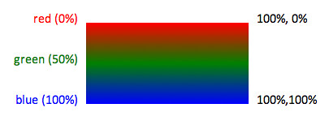
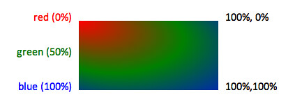

# Color and Gradients

## Color

- `RGB(r int, g int, b int) string`
    creates a style string for the fill color designated
    by the (r)ed, g(reen), (b)lue components.
    <http://www.w3.org/TR/css3-color/>
  
- `RGBA(r int, g int, b int, a float64) string`
    as above, but includes the color's opacity as a value
    between 0.0 (fully transparent) and 1.0 (opaque).
  
## Gradients

- `LinearGradient(id string, x1, y1, x2, y2 uint8, sc []Offcolor)`
    constructs a linear color gradient identified by id,
    along the vector defined by (x1,y1), and (x2,y2).
    The stop color sequence defined in sc. Coordinates are expressed as percentages.
    <http://www.w3.org/TR/SVG11/pservers.html#LinearGradients>

    
  
- `RadialGradient(id string, cx, cy, r, fx, fy uint8, sc []Offcolor)`
    constructs a radial color gradient identified by id,
    centered at (cx,cy), with a radius of r.
    (fx, fy) define the location of the focal point of the light source.
    The stop color sequence defined in sc.
    Coordinates are expressed as percentages.
    <http://www.w3.org/TR/SVG11/pservers.html#RadialGradients>
  
    

---
[Go to the main page][]

[Go to the main page]: ../README.md
