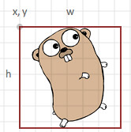
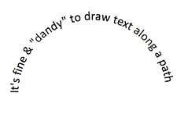

# Image and Text

## Image

- `Image`

    ```go
    // svgo
    Image(x, y int, w, h int, link string, s ...string)
    // float/svgo
    Image(x, y float64, w, h int, link string, s ...string)
    ```

    place at x,y (upper left hand corner), the image with width w, and height h, referenced at link.
    <http://www.w3.org/TR/SVG11/struct.html#ImageElement>

    

## Text

- `Text`

    ```go
    // svgo
    Text(x, y int, t string, s ...string)
    // float/svgo
    Text(x, y float64, t string, s ...string)
    ```

    Place the specified text, t at x,y according to the optional style specified in s.
    <http://www.w3.org/TR/SVG11/text.html#TextElement>

- `Textspan`

    ```go
    // svgo
    Textspan(x, y int, t string, s ...string)
    // float/svgo
    Textspan(x, y float64, t string, s ...string)
    ```

    Place specified text, t at x,y according to the optional style specified in s.
    <https://www.w3.org/TR/SVG11/text.html#TSpanElement>
    Use this method with Span(...). End with TextEnd().

- `Span(t string, s ...string)` Create a text span t, using optional style s.

- `TextEnd()` End a text span.
  
- `Textlines`

    ```go
    // svgo
    Textlines(x, y int, s []string, size, spacing int, fill, align string)
    // float/svgo
    Textlines(x, y float64, s []string, size, spacing int, fill, align string)
    ```

    Places lines of text in s, starting at x,y, at the specified size, fill, and alignment, and spacing.

- `Textpath(t string, pathid string, s ...string)`
    places optionally styled text along a previously defined path.
    <http://www.w3.org/TR/SVG11/text.html#TextPathElement>

    

---
[Go to the main page][]

[Go to the main page]: ../README.md
