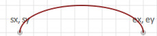
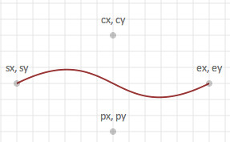
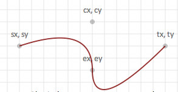
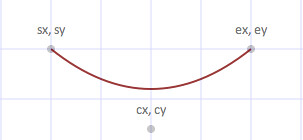

# Paths

- `Path(p string, s ...style)`
    draw the arbitrary path as specified in p, according to the style specified in s. <http://www.w3.org/TR/SVG11/paths.html>

- `Arc`

    ```go
    // svgo
    Arc(sx, sy, ax, ay, r int, large bool, sweep bool, ex int, ey int, s ...string)
    // float/svgo
    Arc(sx, sy, ax, ay, r float64, large bool, sweep bool, ex int, ey int, s ...string)
    ```

    draw an elliptical arc beginning coordinate at sx,sy, ending coordinate at ex, ey
    width and height of the arc are specified by ax, ay, the x axis rotation is r
  
    if sweep is true, then the arc will be drawn in a "positive-angle" direction (clockwise),
    if false, the arc is drawn counterclockwise.
  
    if large is true, the arc sweep angle is greater than or equal to 180 degrees,
    otherwise the arc sweep is less than 180 degrees.
    <http://www.w3.org/TR/SVG11/paths.html#PathDataEllipticalArcCommands>
  
    

- `Bezier`

    ```go
    // svgo
    Bezier(sx, sy, cx, cy, px, py, ex, ey int, s ...string)
    // float/svgo
    Bezier(sx, sy, cx, cy, px, py, ex, ey float64, s ...string)
    ```

    draw a cubic bezier curve, beginning at sx,sy, ending at ex,ey
    with control points at cx,cy and px,py.
    <http://www.w3.org/TR/SVG11/paths.html#PathDataCubicBezierCommands>
  
    

- `Qbezier`

    ```go
    // svgo
    Qbezier(sx, sy, cx, cy, ex, ey, tx, ty int, s ...string)
    // float/svgo
    Qbezier(sx, sy, cx, cy, ex, ey, tx, ty float64, s ...string)
    ```

    draw a quadratic bezier curve, beginning at sx, sy, ending at tx,ty
    with control points are at cx,cy, ex,ey.
    <http://www.w3.org/TR/SVG11/paths.html#PathDataQuadraticBezierCommands>
  
    
  
- `Qbez`

    ```go
    // svgo
    Qbez(sx, sy, cx, cy, ex, ey int, s ...string)
    // float/svgo
    Qbez(sx, sy, cx, cy, ex, ey float64, s ...string)
    ```

    draws a quadratic bezier curver, with optional style beginning at sx,sy, ending at ex, sy
    with the control point at cx, cy.
    <http://www.w3.org/TR/SVG11/paths.html#PathDataQuadraticBezierCommands>

    

---
[Go to the main page][]

[Go to the main page]: ../README.md
