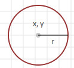
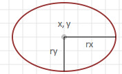
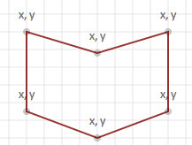
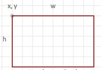
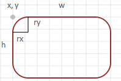
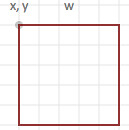
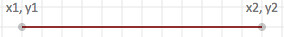
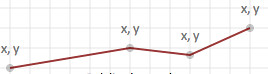

# Shapes and Lines

## Shapes

- `Circle`

    ```go
    // svgo
    Circle(x, y, r int, s ...string)
    // float/svgo
    Circle(x, y, r float64, s ...string)
    ```

    draw a circle, centered at x,y with radius r.
    <http://www.w3.org/TR/SVG11/shapes.html#CircleElement>
  
    
  
- `Ellipse`

    ```go
    // svgo
    Ellipse(x, y, w, h int, s ...string)
    // float/svgo
    Ellipse(x, y, w, h float64, s ...string)
    ```

    draw an ellipse, centered at x,y with radii w, and h.
    <http://www.w3.org/TR/SVG11/shapes.html#EllipseElement>
  
    

- `Polygon`

    ```go
    // svgo
    Polygon(x, y []int, s ...string)
    // float/svgo
    Polygon(x, y []float64, s ...string)
    ```

    draw a series of line segments using an array of x, y coordinates.
    <http://www.w3.org/TR/SVG11/shapes.html#PolygonElement>
  
    

- `Rect`

    ```go
    // svgo
    Rect(x, y, w, h int, s ...string)
    // float/svgo
    Rect(x, y, w, h float64, s ...string)
    ```

    draw a rectangle with upper left-hand corner at x,y, with width w, and height h.
    <http://www.w3.org/TR/SVG11/shapes.html#RectElement>
  
    
  
- `CenterRect`

    ```go
    // svgo
    CenterRect(x, y, w, h int, s ...string)
    // float/svgo
    CenterRect(x, y, w, h float64, s ...string)
    ```

    draw a rectangle with its center at x,y, with width w, and height h.

- `Roundrect`

    ```go
    // svgo
    Roundrect(x, y, w, h, rx, ry int, s ...string)
    // float/svgo
    Roundrect(x, y, w, h, rx, ry float64, s ...string)
    ```

    draw a rounded rectangle with upper the left-hand corner at x,y,
    with width w, and height h. The radii for the rounded portion
    is specified by rx (width), and ry (height).
  
    
  
- `Square`

    ```go
    // svgo
    Square(x, y, s int, style ...string)
    // float/svgo
    Square(x, y, s float64, style ...string)
    ```

    draw a square with upper left corner at x,y with sides of length s.

    

## Lines

- `Line`

    ```go
    // svgo
    Line(x1, y1, x2, y2 int, s ...string)
    // float/svgo
    Line(x1, y1, x2, y2 float64, s ...string)
    ```

    draw a line segment between x1,y1 and x2,y2.
    <http://www.w3.org/TR/SVG11/shapes.html#LineElement>

    

- `Polyline`

    ```go
    // svgo
    Polyline(x, y []int, s ...string)
    // float/svgo
    Polyline(x, y []float64, s ...string)
    ```

    draw a polygon using coordinates specified in x,y arrays.
    <http://www.w3.org/TR/SVG11/shapes.html#PolylineElement>

    

---
[Go to the main page][]

[Go to the main page]: ../README.md
