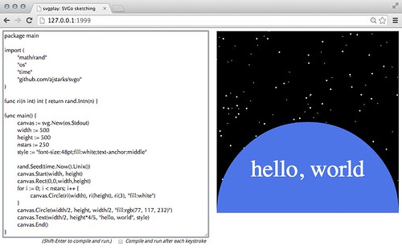

# Graphics Sketching with SVGo and svgplay

Combined with the svgplay command, SVGo can be used to "sketch" with code in a browser.  

To use svgplay and SVGo, first go to a directory with your code, and run:

```shell
./svgplay

2014/06/25 22:05:28 ☠ ☠ ☠ Warning: this server allows a client connecting to 127.0.0.1:1999 to execute code on this computer ☠ ☠ ☠
```

Next open your browser to the svgplay server you just started.
svgplay only listens on localhost, and uses port 1999 (guess which year SVG was first introduced) by default

<http://localhost:1999/>

Enter your code in the textarea, and when you are ready to run press Shift--Enter.
The code will be compiled, with the results on the right.
To update, change the code and repeat. Note that compilation errors are shown in red under the code.
In order for svgplay/SVGo to work, make sure that the io.Writer specified with the New function
is os.Stdout.

If you want to sketch with an existing file, enter its URL:

<http://localhost:1999/foo.go>



---
[Go to the main page][]

[Go to the main page]: ../README.md
